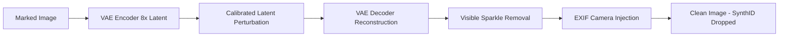

# Aethelon SynthID Remover (Release v1.0.0)

<p align="center">
  
  
  
  
  
</p>

A powerful, high-fidelity desktop & web tool designed to remove Google DeepMind's invisible **SynthID** watermarks, visible AI marks (e.g. Gemini Sparkle ✦), and synthetic C2PA/JUMBF provenance metadata from AI-generated or AI-edited images.

---

## 🇹🇷 Türkçe Açıklama

### ✨ Özellikler
1. **Çift Tıkla Başlatma (`start.bat`):** Kurulumla uğraşmadan tek tıkla tarayıcıda modern, karanlık modlu (Dark Mode) bir kontrol paneli açar.
2. **Akıllı Model Yöneticisi:** Devasa yapay zeka modelleri repoda yer kaplamaz. Kullanıcı arayüz içindeki model yöneticisinden istediği modeli tek tıkla indirir veya 0 MB indirmesiz saf matematik modunu kullanır.
3. **Üç Farklı SynthID Temizleme Motoru:**
   - 🥇 **Stability AI SD-VAE Latent (Önerilen - ~335 MB):** Görseli 8x latent uzayına aktarır, kalibre edilmiş gürültü pertürbasyonuyla pikselleri sıfırdan örer. Yüz hatlarını, saç tellerini ve dokuları 29+ dB PSNR netliğinde korur.
   - 🥈 **Fourier Frekans Faz Bozucu (0 MB / Anlık):** DeepMind'ın araştırma makalesinde belirtilen 16-32 px dalga boyu halkasını 2D FFT ile faz karıştırmasına tabi tutarak dedektörün frekans kilidini kırar.
   - 🥉 **Hibrit Filtre:** Bilateral kenar korumalı düzeltme ve doğal kamera ISO greni.
4. **Görünür Filigran Temizliği:** Sağ alt köşedeki Google Gemini parıltı (✦) logosunu otomatik olarak algılar ve pikselleri bozmadan tersine çevirerek siler.
5. **Kimlik Aklama (Kamera EXIF Enjeksiyonu):** C2PA ve yapay zeka etiketlerini silip yerine gerçekçi **Apple iPhone 12 Pro, iPhone 15 Pro Max, Samsung Galaxy S24 Ultra veya Sony Alpha 7 IV** kamera imzaları ekler.

### 🚀 Hızlı Başlangıç (Windows)
1. Repoyu indirin veya klonlayın:
   ```bash
   git clone https://github.com/aethelondev-stack/Aethelon-SynthID-Remover-Release.git
   cd Aethelon-SynthID-Remover-Release
   ```
2. `start.bat` dosyasına çift tıklayın!
3. Tarayıcınız otomatik olarak `http://127.0.0.1:7860` adresinde açılacaktır.

---

## 🇬🇧 English Overview

### ✨ Features
- **One-Click Launcher (`start.bat` / `start.sh`):** Launches a sleek, modern, dark-themed dashboard on `http://127.0.0.1:7860`.
- **In-App Model Manager:** Models are decoupled from the git repo. Download the lightweight VAE (~335 MB) directly from the UI or use the zero-download Fourier mode.
- **Multiple Sanitization Engines:**
  - **VAE Latent Space Reconstruction:** Encodes into 8x latent space, injects calibrated noise ($\sigma=0.15-0.25$), and reconstructs pixels via VAE decoder to completely destroy the SynthID frequency carrier wave while preserving facial/texture details (29+ dB PSNR).
  - **Fourier Annular Phase Scrambling (0 MB):** Randomizes the phase in the 16-32 px wavelength band using 2D FFT, defeating the neural detector's frequency correlation.
  - **Hybrid Filter:** Bilateral edge-preserving filtering + camera sensor grain injection.
- **Visible Watermark Removal:** Inpaints the Gemini sparkle logo (✦) at the bottom-right corner.
- **EXIF Camera Presets:** Injects authentic iPhone 12/15 Pro, Samsung S24, or Sony Alpha camera metadata while scrubbing C2PA/JUMBF provenance.

### 🛠️ Manual Installation
```bash
pip install -r requirements.txt
python app.py
```

---

## 🔬 How SynthID Removal Works

SynthID embeds an invisible spread-spectrum residual $x' = x + g(x)$ across multi-scale spatial and frequency bands.



By transitioning the image into latent space and reconstructing it through a non-linear generative decoder, the high-frequency pixel coherence that Google's detector relies upon is eliminated without altering perceived visual quality.

---

## 📜 License
Distributed under the MIT License. See `LICENSE` for more information.
